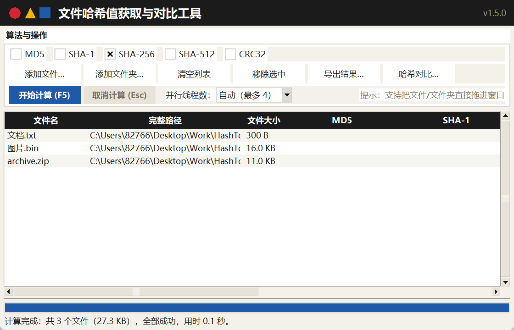
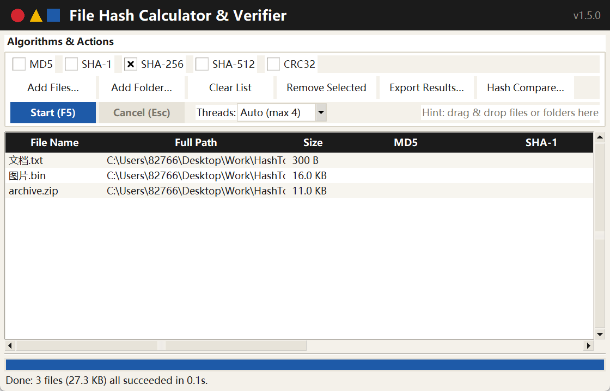
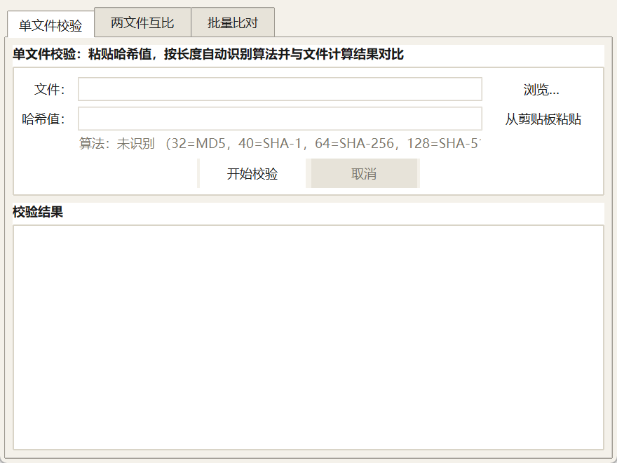
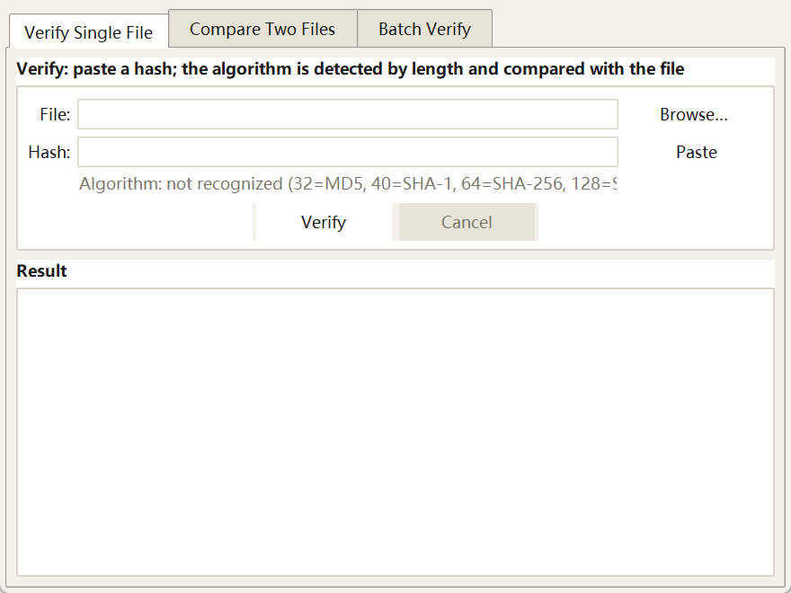

# 文件哈希值获取与对比工具

[](LICENSE)
[](https://github.com/WanQTs/HashTool/actions)
[](https://github.com/WanQTs/HashTool/releases)
[](https://www.python.org/)

**English version: [README_EN.md](README_EN.md)**

Windows 10/11 64 位桌面小工具：计算文件哈希（MD5 / SHA-1 / SHA-256 / SHA-512 / CRC32），并提供三种哈希对比模式。纯 Python 标准库（tkinter）实现，无第三方运行时依赖，最终交付为 **64 位单文件 exe**。

## 功能特性

### 1. 哈希计算
- 五种算法可勾选同时计算：MD5、SHA-1、SHA-256、SHA-512、CRC32
- 三种添加方式：文件选择对话框（可多选）、拖拽文件/文件夹到窗口、添加整个文件夹（递归遍历）
- 大文件按 **8MB 分块读取**（预分配缓冲，不一次性读入内存，避免内存抖动）
- **多文件并行计算**：后台线程池最多 4 线程同时计算，充分利用多核 CPU；线程数可在界面选择（自动 / 1 / 2 / 4）
- 结果表格：文件名、完整路径、文件大小、各算法哈希值、耗时、状态（斑马纹配色，双击/右键可复制）
- 进度条 + 取消按钮，界面不卡死
- 界面为**包豪斯风格**：暖纸底色、墨黑标题带（红圆/黄三角/蓝方块几何标识）、扁平化按钮（主操作实心蓝）、墨黑表头，全局微软雅黑，零第三方依赖
- **中英双语界面**：菜单「语言 / Language」即时切换 中文 / English（主窗口、对比窗口、提示信息、导出表头同步切换），首次启动按系统语言自动选择，选择保存在 `%APPDATA%\HashTool\config.json`

### 2. 哈希对比（重点功能，菜单：工具 → 哈希对比）
| 模式 | 说明 |
| --- | --- |
| 单文件校验 | 粘贴哈希值，按长度自动识别算法（32=MD5、40=SHA-1、64=SHA-256、128=SHA-512、8=CRC32），显示「✔ 一致 / ✘ 不一致」，不一致红色高亮 |
| 两文件互比 | 选择两个文件，对比所选算法的哈希是否相同，逐算法输出结果 |
| 批量比对 | 导入哈希清单（每行 `哈希值  文件名`，兼容 MD5Sum/SHA256SUM/certutil 格式），批量校验目录下文件，输出「通过 / 失败 / 文件缺失 / 格式错误」 |

对比结果颜色：**一致=绿色、不一致=红色、缺失=橙色**。

### 3. 结果导出
- CSV（带 BOM，Excel 可直接打开）
- TXT（标准 SUM 格式，可被其他校验工具识别）
- 双击哈希单元格或右键「复制此单元格」一键复制

## 界面截图

| 主窗口（中文） | 主窗口（English） |
| --- | --- |
|  |  |
| 批量比对（中文） | 批量比对（English） |
|  |  |

## 目录结构

```
HashTool/
├── main.py                # 程序入口（--selftest 自检 / --smoke 冒烟测试）
├── app.py                 # tkinter 图形界面（主窗口 + 三种对比模式）
├── hash_core.py           # 哈希核心逻辑（与 GUI 分离，可独立测试）
├── i18n.py                # 中英双语字符串表、语言检测与配置持久化
├── dnd.py                 # Windows 原生拖拽支持（ctypes，零第三方依赖）
├── make_icon.py           # 图标生成脚本（纯 Python，包豪斯三原色几何图形）
├── benchmark.py           # 并行计算基准脚本（1/2/4 线程对比）
├── conftest.py            # pytest 夹具（项目内临时目录）
├── tests/
│   ├── test_hash_core.py  # 核心逻辑单元测试（官方已知值验证）
│   ├── test_app_worker.py # 并行计算工作线程测试（无需图形环境）
│   ├── test_i18n.py       # 双语字符串完整性 / 英文模式行为测试
│   └── test_gui_smoke.py  # GUI 冒烟测试（主流程与三种对比模式，无显示时自动跳过）
├── pytest.ini             # pytest 配置
├── ruff.toml              # ruff 静态检查配置
├── build.bat              # 一键打包脚本
├── .github/workflows/ci.yml   # GitHub Actions：push/PR 自动跑 pytest + ruff
├── docs/screenshots/      # README 界面截图（中英文）
├── README.md / README_EN.md / CHANGELOG.md
└── dist/
    └── HashTool.exe        # 打包产物（64 位单文件）
```

## 使用方法

- 直接运行 `dist\HashTool.exe`（无需安装 Python）。
- 开发模式运行：`python main.py`
- 使用 `python main.py --selftest` 可无界面自检内置算法是否正常。
- 切换语言：菜单「语言 / Language」→ 中文 / English；首次启动按系统语言自动选择。

## 运行单元测试

```bat
python -m pip install pytest
python -m pytest
```

## 静态检查（ruff）

```bat
python -m pip install ruff
python -m ruff check
```

规则集见 `ruff.toml`（面向桌面 GUI 裁剪：启用 E/F/I/UP/B/PIE 等，未启用 BLE/S 安全审计类规则）。

测试用官方已知值验证各算法（例如 `"abc"` 的 SHA-256 = `ba7816bf8f01cfea414140de5dae2223b00361a396177a9cb410ff61f20015ad`），并覆盖分块读取、取消、算法识别、清单解析、批量校验、导出等场景；另含 GUI 冒烟测试（主流程与三种对比模式，在无图形环境自动跳过）。

## 性能基准（本机实测）

运行 `python benchmark.py`（6 个 128MB 文件共 768MB；MD5+SHA-256+SHA-512 三种算法；每配置 2 轮取最优；测试机 32 逻辑核心）：

| 线程数 | 耗时 | 吞吐 | 加速比 |
| ---: | ---: | ---: | ---: |
| 1 | 1.55 s | 494 MB/s | x1.00 |
| 2 | 0.99 s | 779 MB/s | x1.58 |
| 4 | 0.65 s | 1190 MB/s | x2.41 |

多线程加速来自 hashlib 对大块数据的 GIL 释放；在机械硬盘等随机读较慢的介质上收益会降低，此时可在界面把「并行线程数」调为 1。

## 打包命令（PyInstaller）

```bat
python -m pip install pyinstaller
python -m PyInstaller --noconfirm --clean --onefile --noconsole ^
  --name "HashTool" --icon "%CD%\app.ico" ^
  --distpath dist --workpath build --specpath build main.py
```

或直接运行 `build.bat`。要求使用 **64 位 Python（3.11+）**，产物为 `dist\HashTool.exe` 单文件，目标系统 Windows 10/11 64 位。

## 常见问题

- **杀毒软件误报**：PyInstaller `--onefile` 打包的程序偶尔被误报，添加信任即可；如介意可改用 `--onedir` 打包。
- **拖拽不可用**：拖拽基于 Windows 原生消息（WM_DROPFILES），仅支持 Windows；非 Windows 环境自动禁用。
- **批量比对清单格式**：每行 `哈希值  文件名`（空格或制表符分隔均可），支持 `#`/`;` 注释与 `MD5 (文件名) = 哈希值`（certutil）格式；文件名可含相对子目录。
- **界面美化（可选）**：默认界面为包豪斯风格（暖纸底色、墨黑标题带、三原色几何图标与扁平控件），并自带微软雅黑字体、斑马纹表格与窗口图标；`pip install ttkbootstrap` 后重新运行/打包，ttk 控件自动切换为 cosmo 主题（标题带等品牌元素保持包豪斯风格）。
- **语言设置**：保存在 `%APPDATA%\HashTool\config.json`（旧版中文目录的配置在启动时自动迁移并清理），删除该文件可恢复自动检测；计算过程中产生的错误信息以产生时的语言显示，切换语言后新产生的信息按新语言显示。
